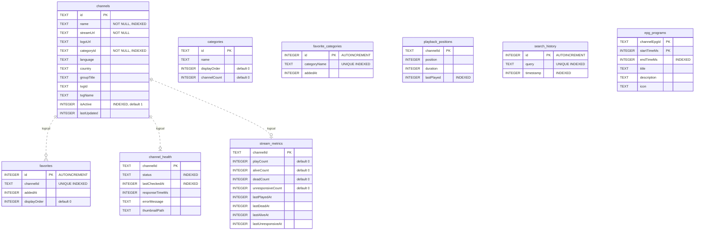

# API Reference

## REST API Endpoints

Base URL: Configured via `BuildConfig.API_BASE_URL` (default: `https://tv.cadnative.com/`)

The Retrofit calls go through the OkHttp interceptor in `NetworkModule`, which adds:
```
Accept: application/json
X-TV-Code: <tv_code_from_settings>      # the paired channel-list code; redacted in logs
Content-Type: application/json          # only when the request has a body
```

> **Note:** Device pairing and in-app-update calls do **not** use this Retrofit client or the
> `X-TV-Code` header. They go through `PinnedHttpClient` (a separate OkHttp instance) against the
> server URL from `AppPreferences.getServerUrl()` (default `https://tv.cadnative.com`). See
> [Device Pairing](#device-pairing-pairingviewmodel--pairingactivity) and
> [App Updates](#app-updates-appupdater) below.

### Channels

#### GET /api/v1/channels

Fetch all channels.

**Response:** `ChannelsResponse`
```json
{
  "success": true,
  "data": [
    {
      "channelId": "ch_123",
      "channelName": "BBC World",
      "channelUrl": "https://stream.example.com/bbc.m3u8",
      "channelImg": "https://img.example.com/bbc.png",
      "tvgLogo": "https://img.example.com/bbc-hd.png",
      "channelGroup": "News",
      "channelDrmKey": null,
      "channelDrmType": null,
      "tvgLanguage": "en",
      "tvgCountry": "GB",
      "tvgId": "BBCWorld.uk",
      "tvgName": "BBC World News",
      "isActive": true,
      "metadata": { "language": "English" },
      "alternateStreams": [
        { "streamUrl": "https://alt.example.com/bbc.m3u8", "quality": "720p" }
      ]
    }
  ]
}
```

Field names map via `@SerializedName` in `ChannelDto` (`data/model/dto/ChannelDto.kt`): `channelId`→`id`,
`channelName`→`name`, `channelUrl`→`url`, `channelGroup`→`groupTitle`, `channelDrmKey`→`drmKey`,
`channelDrmType`→`drmType`. `logoUrl` is derived client-side (prefers `tvgLogo`, falls back to `channelImg`).
`alternateStreams[]` (optional) carries backup stream URLs — the app loads them into the in-memory
`StreamSlot` queue in `ErrorRecoveryManager`; there is **no separate fallback endpoint**.

#### GET /api/v1/channels/{id}

Fetch a single channel by ID.

**Path parameter:** `id` — Channel identifier

**Response:** `ChannelDto` (same structure as items in the channels array)

### Categories

#### GET /api/v1/categories

Fetch all channel categories.

**Response:** `CategoriesResponse`
```json
{
  "categories": [
    {
      "id": "news",
      "name": "News",
      "display_order": 1,
      "channel_count": 45
    }
  ],
  "total": 12
}
```

### Favorites

#### GET /api/v1/favorites

Pull server-stored favorites on app launch. Merged with local Room favorites (server timestamp wins on conflict).

**Response:** `FavoritesResponse`
```json
{
  "channel_ids": ["ch_123", "ch_456"],
  "timestamp": 1710500000000
}
```

#### POST /api/v1/favorites

Sync local favorites to server.

**Request body:** `FavoritesRequest`
```json
{
  "channel_ids": ["ch_123", "ch_456"],
  "device_id": "device_abc",
  "timestamp": 1710500000000
}
```

**Response:** `204 No Content` on success

### Stream Health Reporting

#### POST /api/v1/channels/{id}/report-status

Report a stream as dead, alive, or unresponsive. Called fire-and-forget from `PlayerViewModel` — never blocks playback.

**Path parameter:** `id` — Channel identifier

**Request body:** `StreamStatusReport`
```json
{
  "status": "dead",
  "deviceId": "device_abc",
  "timestamp": 1710500000000,
  "errorMessage": "Connection refused"
}
```

- `status`: `"dead"` (5 retries exhausted), `"alive"` (stream confirmed working), `"unresponsive"` (buffering >30 s)
- `deviceId`: `Settings.Secure.ANDROID_ID`
- `timestamp`: epoch milliseconds (`Long`), not an ISO string
- Sent fire-and-forget from `StreamMetricsRepositoryImpl` (also increments local counters in the `stream_metrics` table)

**Response:** `Response<Unit>` (body ignored)

#### POST /api/v1/channels/{id}/report-play

Report a successful play event (stream produced frames for ≥10 s). Also used when an alternate stream played — the `streamUrl` field triggers server-side auto-promotion of that alternate to primary.

**Request body:** `StreamPlayReport`
```json
{
  "deviceId": "device_abc",
  "timestamp": 1710500300000,
  "proxyPlay": false,
  "streamUrl": "https://alt-stream.example.com/live.m3u8"
}
```

- `timestamp`: epoch milliseconds (`Long`)
- `proxyPlay`: `true` when ExoPlayer fell back to the TV proxy
- `streamUrl` (optional): actual stream URL played; if it matches an alternate, server auto-promotes it to primary

**Response:** `Response<Unit>` (body ignored)

#### POST /api/v1/channels/health-sync

Bulk sync results from a `ChannelHealthScanner` batch. Called after each scan cycle.

**Request body:** `HealthSyncRequest`
```json
{
  "deviceId": "device_abc",
  "results": [
    {
      "channelId": "ch_123",
      "status": "alive",
      "responseTimeMs": 320,
      "timestamp": 1710500600000
    }
  ]
}
```

- Each item (`HealthSyncItem`): `channelId`, `status`, `responseTimeMs` (`Long?`), `timestamp` (epoch ms `Long`)
- Bulk sync of a `ChannelHealthScanner` batch; server uses MongoDB `bulkWrite` for efficiency

**Response:** `Response<Unit>` (body ignored)

### EPG Guide

#### GET /api/v1/tv/epg/{channelListCode}/json

Fetch the electronic program guide for the paired channel list. Used by `EpgRepositoryImpl` to feed
the Guide grid and the player's now/next overlay. Programs are merged with any user-configured XMLTV
source and persisted to the `epg_programs` Room table (last-good fallback).

**Path parameter:** `channelListCode` — the paired TV code (`AppPreferences.getTvCode`)

**Query parameter:** `hours` — window length in hours (default `12`)

**Response:** `EpgGuideResponse`
```json
{
  "success": true,
  "channels": [
    {
      "channelId": "BBCWorld.uk",
      "channelName": "BBC World News",
      "tvgLogo": "https://img.example.com/bbc.png",
      "programs": [
        {
          "title": "News Hour",
          "description": "World headlines",
          "start": "2026-07-15T10:00:00Z",
          "end": "2026-07-15T11:00:00Z",
          "icon": "https://img.example.com/newshour.png"
        }
      ]
    }
  ]
}
```

- `start` / `end` are ISO-8601 instants (parsed with `Instant.parse`)

### Playlist

#### GET /api/v1/channels/playlist.m3u

Download the full channel playlist in M3U format.

**Response:** `ResponseBody` (plain text M3U content)

### Demo Code

#### GET /api/v1/app/demo-code

Fetch a demo channel-list code, offered on the pairing screen as a "try it" fallback.

**Response:** `Map<String, String>` — a JSON object whose `code` field is the demo channel-list code.

### App Updates (`AppUpdater`)

> These calls use `PinnedHttpClient`, not Retrofit. Base URL from `AppPreferences.getServerUrl()`.

#### GET /api/v1/app/version?currentVersion={versionCode}

Check for app updates.

**Query parameter:** `currentVersion` — current app version code (integer)

**Request header:** `X-Session-ID: <tv_code>` (the paired channel-list code)

**Response:** update payload; when `updateAvailable` is true the details live under `latestVersion`:
```json
{
  "success": true,
  "updateAvailable": true,
  "isMandatory": false,
  "latestVersion": {
    "versionName": "2.2.3",
    "releaseNotes": "Bug fixes and performance improvements",
    "apkFileSize": 15728640,
    "downloadUrl": "https://tv.cadnative.com/api/v1/app/download"
  }
}
```

If this check fails, `AppUpdater` falls back to the **GitHub Releases** API
(`GET https://api.github.com/repos/akshaynikhare/FireVisionIPTV/releases/latest`, `Accept: application/vnd.github+json`)
and reads `tag_name`, `body`, and the APK `assets[]` (`name`, `browser_download_url`, `size`).

The APK itself is downloaded with the Android system `DownloadManager` (to
`getExternalFilesDir(DIRECTORY_DOWNLOADS)/FireVisionIPTV.apk`), and the completion receiver is
registered with `RECEIVER_EXPORTED` to fix downloads stalling on Android 13+.

### Device Pairing (`PairingViewModel` / `PairingActivity`)

> These calls use `PinnedHttpClient`, not Retrofit, and send no `X-TV-Code` header.

#### POST /api/v1/tv/pairing/request

Request a new pairing PIN.

**Request body:**
```json
{
  "deviceName": "Fire TV Stick",
  "deviceModel": "Amazon AFTKA"
}
```

**Response:**
```json
{
  "success": true,
  "pin": "123456",
  "expiresAt": "2026-07-15T12:00:00Z"
}
```

#### GET /api/v1/tv/pairing/status/{pin}

Poll pairing status.

**Path parameter:** `pin` — 6-digit PIN from the pairing request

**Response (pending):**
```json
{
  "paired": false,
  "status": "pending"
}
```

**Response (paired):**
```json
{
  "paired": true,
  "status": "completed",
  "channelListCode": "ABC123",
  "username": "user@example.com"
}
```

On success the app stores `channelListCode` as the TV code
(`AppPreferences.setTvCode`, plaintext — see [ADR-003](decisions/003-plaintext-tv-code-storage.md)).

---

## Repository Interfaces

### ChannelRepository

```kotlin
fun getChannels(): Flow<Result<List<Channel>>>
fun getChannelById(id: String): Flow<Result<Channel>>
fun getChannelsByCategory(category: String): Flow<Result<List<Channel>>>
fun searchChannels(query: String): Flow<Result<List<Channel>>>
suspend fun refreshChannels(): Result<Unit>
suspend fun addToFavorites(channelId: String): Result<Unit>
suspend fun removeFromFavorites(channelId: String): Result<Unit>
fun getFavoriteChannels(): Flow<Result<List<Channel>>>
```

### CategoryRepository

```kotlin
fun getCategories(): Flow<Result<List<Category>>>
fun getCategoryById(id: String): Flow<Result<Category>>
suspend fun refreshCategories(): Result<Unit>
```

### FavoriteRepository

```kotlin
fun getFavoriteChannels(): Flow<Result<List<Channel>>>
fun isFavorite(channelId: String): Flow<Result<Boolean>>
suspend fun addFavorite(channelId: String): Result<Unit>
suspend fun removeFavorite(channelId: String): Result<Unit>
suspend fun toggleFavorite(channelId: String): Result<Unit>
suspend fun updateFavoriteOrder(channelId: String, newOrder: Int): Result<Unit>
suspend fun syncFavorites(): Result<Unit>
suspend fun pullFavoritesFromServer(): Result<Unit>  // pulls & merges server favorites on app launch
```

### PlaybackRepository

```kotlin
fun getPlaybackPosition(channelId: String): Flow<Result<Long?>>
suspend fun savePlaybackPosition(channelId: String, position: Long, duration: Long): Result<Unit>
suspend fun deletePlaybackPosition(channelId: String): Result<Unit>
fun getAllPlaybackPositions(): Flow<Result<Map<String, Long>>>
suspend fun clearOldPositions(keepCount: Int = 100): Result<Unit>
```

### PlaylistRepository

```kotlin
suspend fun parsePlaylistFromUrl(url: String): Result<List<Channel>>
suspend fun parsePlaylistFromString(content: String): Result<List<Channel>>
suspend fun importChannels(channels: List<Channel>): Result<Unit>
```

> No bound implementation. Actual M3U / Xtream import is orchestrated inside `ChannelRepositoryImpl`
> using `M3uDataSource` and `XtreamDataSource`. Xtream stream URLs are stored with
> `{username}`/`{password}` placeholders (`StreamUrlTemplate`) and resolved from
> `EncryptedSharedPreferences` at use time; credentials are never persisted in Room.

### StreamMetricsRepository

```kotlin
suspend fun reportStreamDead(channelId: String, errorMessage: String?): Result<Unit>
suspend fun reportStreamAlive(channelId: String): Result<Unit>
suspend fun reportStreamUnresponsive(channelId: String): Result<Unit>
suspend fun reportStreamPlay(channelId: String, proxyPlay: Boolean = false, streamUrl: String? = null): Result<Unit>
suspend fun syncHealthResults(results: List<HealthSyncEntry>): Result<Unit>
```

Each call bumps a local counter in the `stream_metrics` table and fires the matching endpoint
(`report-status` / `report-play` / `health-sync`) fire-and-forget.

### EpgRepository

```kotlin
suspend fun getNowNext(tvgId: String): Pair<EpgProgram?, EpgProgram?>
suspend fun ensureLoaded()
suspend fun refreshNow()
fun getNowNextIfCached(tvgId: String): Pair<EpgProgram?, EpgProgram?>?   // synchronous; null if not hydrated
suspend fun getProgramsWindow(tvgIds: List<String>, from: Instant, to: Instant): Map<String, List<EpgProgram>>
suspend fun clearAll()
```

### SearchHistoryRepository

```kotlin
fun getRecentSearches(limit: Int = 10): Flow<Result<List<String>>>
suspend fun saveSearch(query: String): Result<Unit>
suspend fun clearHistory(): Result<Unit>
suspend fun removeSearch(query: String): Result<Unit>
```

### UserPreferencesRepository

```kotlin
fun getTheme(): Flow<String>                              // default: "dark"
suspend fun setTheme(theme: String): Result<Unit>
fun getGridSize(): Flow<Int>                              // default: 3
suspend fun setGridSize(size: Int): Result<Unit>
fun getFontSize(): Flow<Float>                            // default: 1.0f
suspend fun setFontSize(scale: Float): Result<Unit>
fun getAnimationSpeed(): Flow<Float>                      // default: 1.0f
suspend fun setAnimationSpeed(speed: Float): Result<Unit>
fun getLayoutDensity(): Flow<String>                      // default: "comfortable"
suspend fun setLayoutDensity(density: String): Result<Unit>
suspend fun clearCache(): Result<Unit>

// Back-press / player behaviour (added since v2.1)
fun getBackExitProtection(): Flow<Boolean>
suspend fun setBackExitProtection(enabled: Boolean): Result<Unit>
fun getPlayerKeyUpDownAction(): Flow<String>
suspend fun setPlayerKeyUpDownAction(action: String): Result<Unit>
fun getPlayerKeyLeftRightAction(): Flow<String>
suspend fun setPlayerKeyLeftRightAction(action: String): Result<Unit>
fun getPlayerLongOkAction(): Flow<String>
suspend fun setPlayerLongOkAction(action: String): Result<Unit>
fun getSleepTimerDefaultMinutes(): Flow<Int>
suspend fun setSleepTimerDefaultMinutes(minutes: Int): Result<Unit>
fun getAlwaysShowProgramBar(): Flow<Boolean>
suspend fun setAlwaysShowProgramBar(enabled: Boolean): Result<Unit>
fun getInfoBarTimeoutSeconds(): Flow<Int>
suspend fun setInfoBarTimeoutSeconds(seconds: Int): Result<Unit>
```

---

## Use Cases

| Use Case | Type | Input | Output |
|----------|------|-------|--------|
| `GetChannelsUseCase` | Flow | `Unit` | `Flow<Result<List<Channel>>>` |
| `GetChannelByIdUseCase` | Flow | `String` (channelId) | `Flow<Result<Channel>>` |
| `GetChannelsByCategoryUseCase` | Flow | `String` (category) | `Flow<Result<List<Channel>>>` |
| `RefreshChannelsUseCase` | Suspend | `Unit` | `Result<Unit>` |
| `SearchChannelsUseCase` | Flow | `Params(query, filters)` | `Flow<Result<List<Channel>>>` |
| `GetRecentSearchesUseCase` | Flow | `Int` (limit) | `Flow<Result<List<String>>>` |
| `SaveSearchQueryUseCase` | Suspend | `String` (query) | `Result<Unit>` |
| `ClearSearchHistoryUseCase` | Suspend | `Unit` | `Result<Unit>` |
| `GetFavoriteChannelsUseCase` | Flow | `Unit` | `Flow<Result<List<Channel>>>` |
| `ToggleFavoriteUseCase` | Suspend | `String` (channelId) | `Result<Unit>` |
| `ReorderFavoritesUseCase` | Suspend | `Params(channelId, newOrder)` | `Result<Unit>` |
| `PullFavoritesUseCase` | Suspend | `Unit` | `Result<Unit>` |
| `GetPlaybackPositionUseCase` | Flow | `String` (channelId) | `Flow<Result<PlaybackState?>>` |
| `SavePlaybackPositionUseCase` | Suspend | `Params(channelId, position, duration)` | `Result<Unit>` |
| `ReportStreamStatusUseCase` | Suspend | `Params(channelId, status, errorMessage?)` | `Result<Unit>` |
| `ReportStreamPlayUseCase` | Suspend | `Params(channelId, proxyPlay, streamUrl?)` | `Result<Unit>` |
| `SyncHealthResultsUseCase` | Suspend | `Params(results[])` | `Result<Unit>` |
| `GetGuideProgramsUseCase` | Suspend | `Params(tvgIds, from, to)` | `Map<String, List<EpgProgram>>` |

`deviceId` is resolved inside `StreamMetricsRepositoryImpl` (from `ANDROID_ID`), so the stream-report
use cases no longer take it as a parameter. Total: 18 use cases.

---

## Database Schema

`FireVisionDatabase` is at **version 8** (7 migrations). As of the v6→v7 migration the user-data tables
(`favorites`, `channel_health`, `stream_metrics`) dropped their foreign keys to `channels` so a full
channel resync never cascades away user data — the relationships below are logical, not enforced FKs.

### Entity Relationship Diagram



### Foreign Keys

None. All cross-table relationships are resolved in query/repository logic; foreign keys were removed
in the v6→v7 migration so channel resyncs never cascade-delete user data.

### Indices

| Table | Index | Columns |
|-------|-------|---------|
| `channels` | `index_channels_categoryId` | `categoryId` |
| `channels` | `index_channels_isActive` | `isActive` |
| `channels` | `index_channels_name` | `name` |
| `channel_health` | `index_channel_health_channelId` (unique) | `channelId` |
| `channel_health` | `index_channel_health_lastCheckedAt` | `lastCheckedAt` |
| `channel_health` | `index_channel_health_status` | `status` |
| `stream_metrics` | `index_stream_metrics_channelId` (unique) | `channelId` |
| `favorites` | `index_favorites_channelId` (unique) | `channelId` |
| `favorite_categories` | `index_favorite_categories_categoryName` (unique) | `categoryName` |
| `playback_positions` | `index_playback_positions_lastPlayed` | `lastPlayed` |
| `search_history` | `index_search_history_timestamp` | `timestamp` |
| `search_history` | `index_search_history_query` (unique) | `query` |
| `epg_programs` | `index_epg_programs_endTimeMs` | `endTimeMs` |
