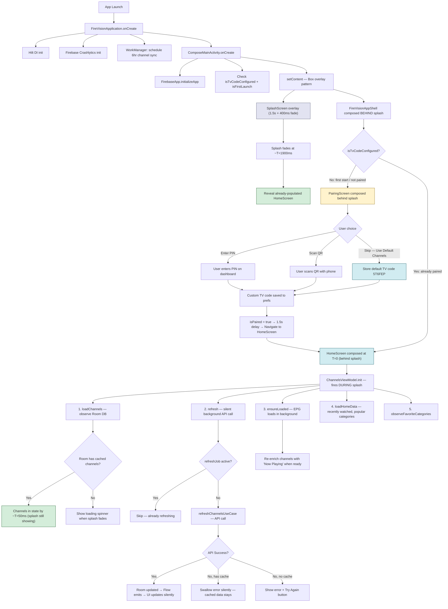
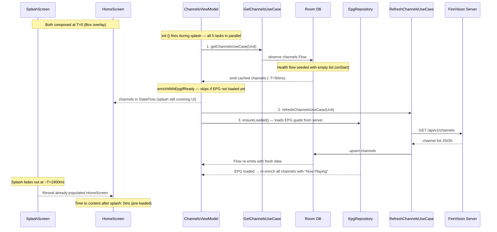
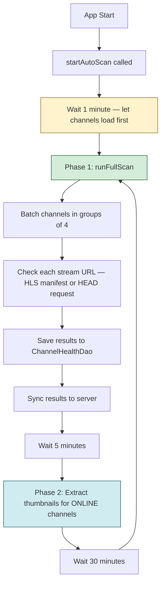
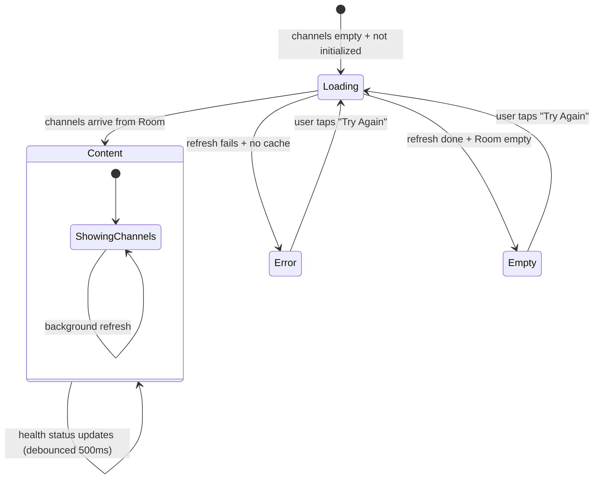
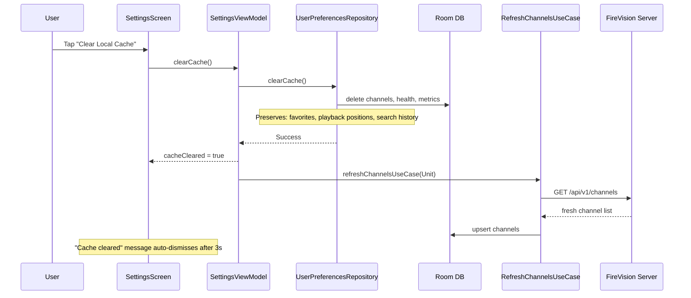
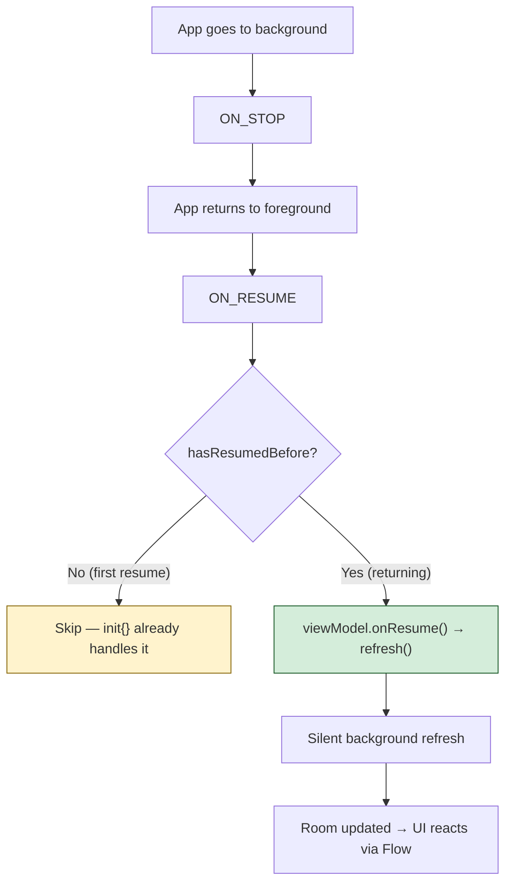

# App Startup & Channel Loading Flow

## Overview

On app start, the priority is **show channels fast**. The app shell and ViewModel are composed **behind the splash screen**, so data loading starts at T=0. Cached data is ready before splash finishes. Server refresh, EPG, and health scanning are deferred and non-blocking.

---

## App Startup Flow



## Channel Loading — Detail



## Health Scanner Lifecycle



## State Machine — HomeScreen Content



```
ContentState logic (HomeScreen):
  isLoading && channels.isEmpty()           → "loading"
  error != null && channels.isEmpty()       → "error"
  channels.isEmpty() && !isInitialLoadComplete → "loading"
  channels.isEmpty()                        → "empty"
  else                                      → "content"
```

## Clear Cache Flow (Settings)



## Resume / Background Detection



Implemented via `DisposableEffect` + `LifecycleEventObserver` in HomeScreen, with `hasResumedBefore` guard in ChannelsViewModel.

## Key Design Decisions

| Decision | Rationale |
|----------|-----------|
| App shell composed behind splash | ViewModel init{} fires at T=0 — channels pre-loaded before splash fades |
| EPG enrichment non-blocking | `getNowNextIfCached()` skips if EPG not loaded — channels render instantly, "Now Playing" titles appear later |
| Health flow seeded with empty list | `onStart { emit(emptyList()) }` after debounce lets `combine` fire immediately — no 500ms wait |
| Show cached channels instantly | Users shouldn't wait for network on every launch |
| Health scan delayed 1 min | Let channel list load and render first — health is secondary |
| Silent refresh when cache exists | No loading flash, no error toast — just update in background |
| OFFLINE channels stay visible | Health dot indicator communicates status; hiding causes flicker during scan |
| 500ms debounce on health flow | Prevents rapid UI recomposition during batch scanning |
| refreshJob guard | Prevents duplicate concurrent refresh calls |
| Resume triggers silent refresh | Detects server-side changes when returning from background |
