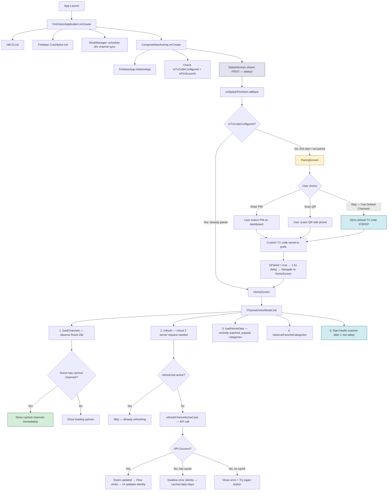
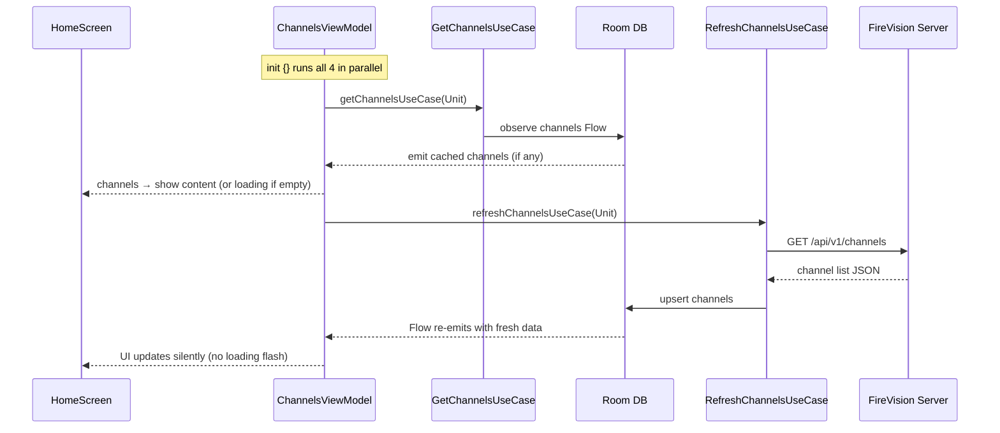
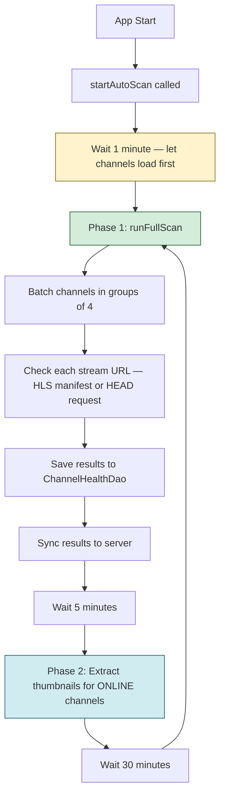
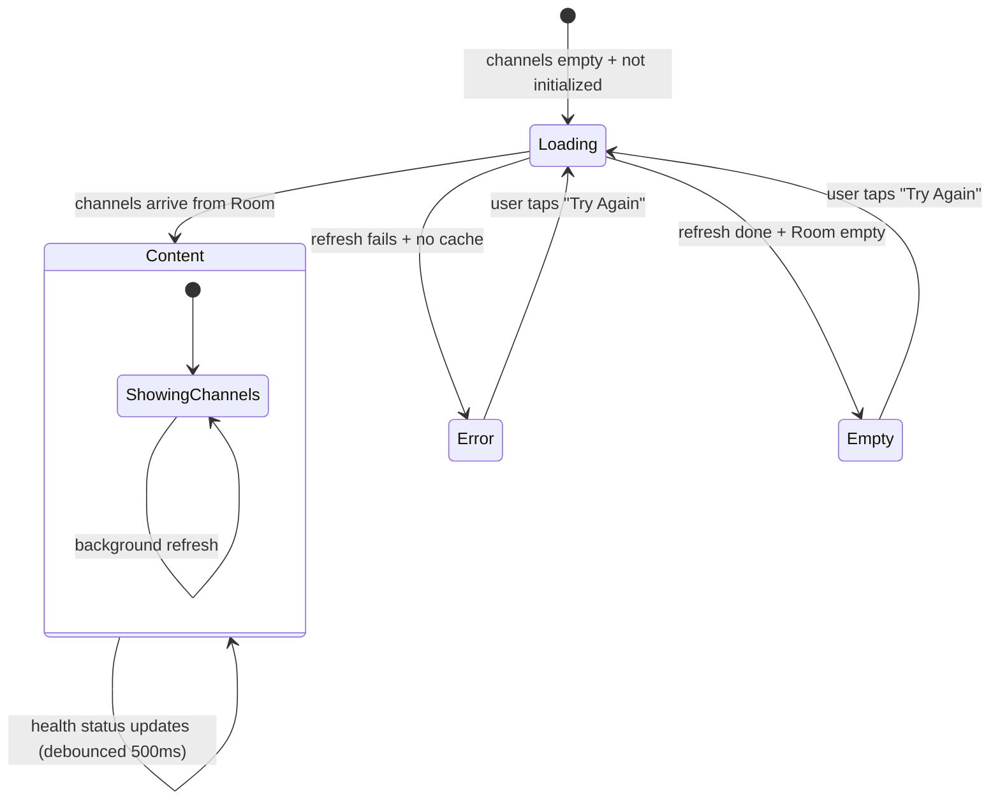
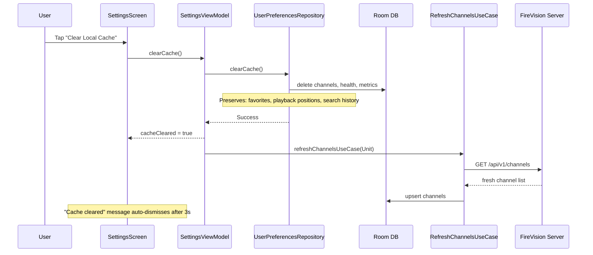
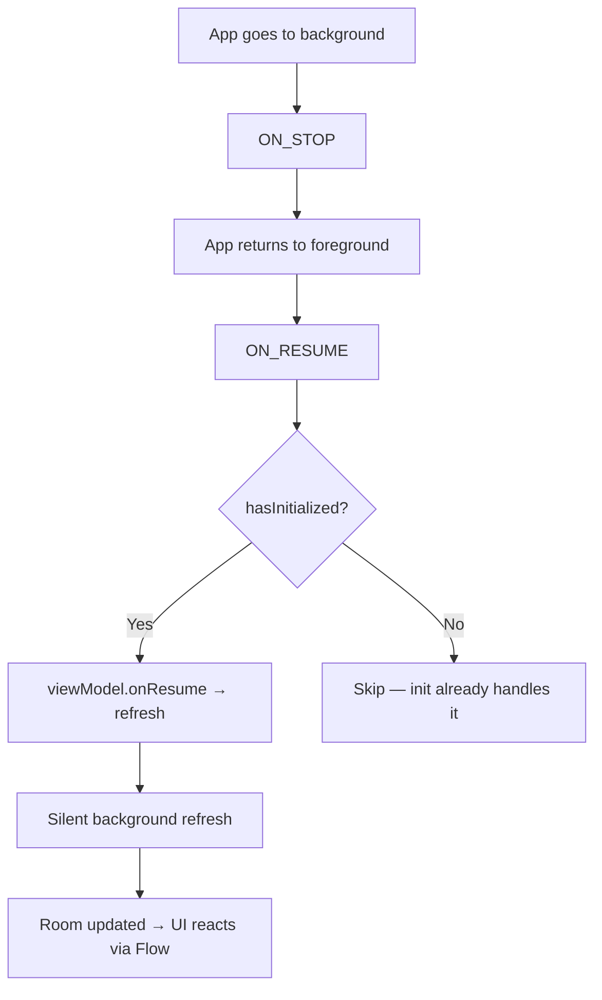

# App Startup & Channel Loading Flow

## Overview

On app start, the priority is **show channels fast**. Cached data appears instantly. Server refresh and health scanning are deferred to avoid blocking the UI.

---

## App Startup Flow



## Channel Loading — Detail



## Health Scanner Lifecycle



## State Machine — HomeScreen Content



```
ContentState logic (HomeScreen):
  isLoading && channels.isEmpty()           → "loading"
  error != null && channels.isEmpty()       → "error"
  channels.isEmpty() && !isInitialLoadComplete → "loading"
  channels.isEmpty()                        → "empty"
  else                                      → "content"
```

## Clear Cache Flow (Settings)



## Resume / Background Detection (Planned)



## Key Design Decisions

| Decision | Rationale |
|----------|-----------|
| Show cached channels instantly | Users shouldn't wait for network on every launch |
| Health scan delayed 1 min | Let channel list load and render first — health is secondary |
| Silent refresh when cache exists | No loading flash, no error toast — just update in background |
| OFFLINE channels stay visible | Health dot indicator communicates status; hiding causes flicker during scan |
| 500ms debounce on health flow | Prevents rapid UI recomposition during batch scanning |
| refreshJob guard | Prevents duplicate concurrent refresh calls |
