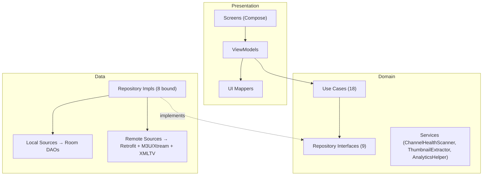
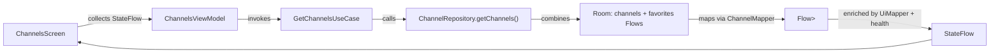
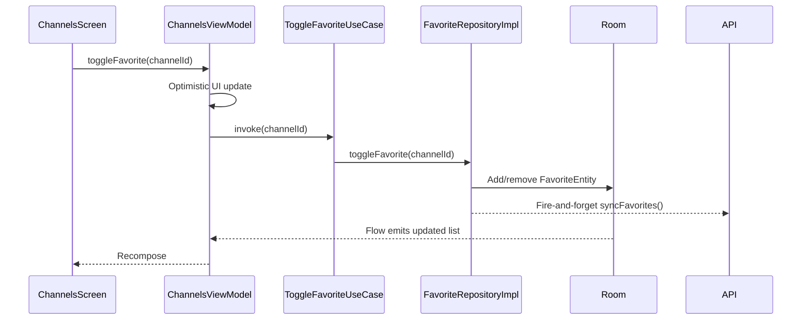
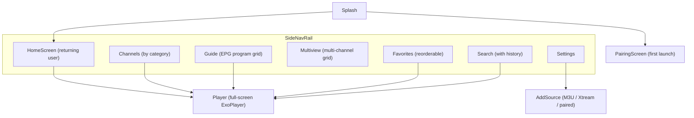

# Architecture

Clean Architecture with three layers. Dependencies flow inward only.



## Presentation Layer

| Component | Role |
|-----------|------|
| `ComposeMainActivity` | Entry point. Uses **Box overlay pattern**: app shell composes behind opaque splash so ViewModels init during splash, not after. Orientation-adaptive: landscape uses side rail, portrait uses bottom nav. Owns `PipController` for the mobile player's picture-in-picture. |
| `FireVisionNavGraph` | 12 destinations (Jetpack Navigation Compose): Pairing, Home, Channels, Categories, Guide, Multiview, Search, Favorites, Settings, AddSource, Player, ChannelsByCategory. Player takes `channelId` + optional `catchupStart`/`catchupDur` args; Multiview takes an optional `channelId`. |
| ViewModels (9) | `ChannelsViewModel`, `FavoritesViewModel`, `SearchViewModel`, `PlayerViewModel`, `SettingsViewModel`, `PairingViewModel`, `GuideViewModel`, `MultiviewViewModel`, `AppUpdateViewModel` — all `@HiltViewModel`. |
| UI Mappers | `ChannelUiMapper`, `CategoryUiMapper`, `GuideUiMapper` — enrich domain models with health status, thumbnails, and EPG rows. |
| Player | Split into TV chrome and a mobile overhaul (`presentation/ui/screens/player/`): gesture overlays, mobile chrome, portrait tabs, tracks panel, quick actions, orientation, and a configurable D-pad key handler. `PipController` drives auto-enter PiP (API 31+) with prev/next channel remote actions. |
| Guide | EPG program grid (`screens/guide/`): channels × 30-min time slots over a 12-hour window, sticky channel column, horizontal scroll, "now" line, All/Favorites/Category filter bar. Rows hydrate lazily as they scroll into view. |
| Multiview | Multi-channel grid (`MultiviewScreen`, `MultiviewViewModel`): up to 4 panes (capped to 2 on low-RAM devices), one ExoPlayer per pane via `PlayerFactory`, only the focused pane plays audio, LazyColumn channel picker. |
| Add Source | `AddSourceScreen`: tabbed import for the managed (paired) server, an M3U URL, or Xtream host/username/password. |
| Update | `UpdateAvailableScreen` + `AppUpdateViewModel` present the update-available flow, backed by `update/AppUpdater`. |

## Domain Layer

Pure Kotlin, no Android dependencies.

| Component | Role |
|-----------|------|
| Domain Models (7) | `Channel`, `Category`, `ChannelHealthStatus`, `PlaybackState`, `SearchFilter`, `EpgProgram`, `StreamMetrics` |
| Repository Interfaces (9) | `ChannelRepository`, `CategoryRepository`, `FavoriteRepository`, `PlaybackRepository`, `PlaylistRepository`, `SearchHistoryRepository`, `UserPreferencesRepository`, `EpgRepository`, `StreamMetricsRepository`. (`PlaylistRepository` has no bound impl — M3U/Xtream import is handled inside `ChannelRepositoryImpl` via the playlist data sources.) |
| Use Cases (18) | `UseCase<P, R>` (suspend, one-shot) and `FlowUseCase<P, R>` (reactive). Includes: `PullFavoritesUseCase`, `ReportStreamStatusUseCase`, `ReportStreamPlayUseCase`, `SyncHealthResultsUseCase`, `GetGuideProgramsUseCase`. |
| Services | `ChannelHealthScanner` (batch HTTP checks + server sync), `ChannelThumbnailExtractor` (frame extraction), `AnalyticsHelper` (Firebase). |

## Data Layer

| Component | Role |
|-----------|------|
| Room Database | `FireVisionDatabase` (v8, 7 migrations): 9 entities — `ChannelEntity`, `CategoryEntity`, `FavoriteEntity`, `SearchHistoryEntity`, `PlaybackPositionEntity`, `ChannelHealthEntity`, `FavoriteCategoryEntity`, `StreamMetricsEntity`, `EpgProgramEntity`. Since v7 the user-data tables (favorites, channel_health, stream_metrics) carry **no foreign keys** to `channels`, so channel syncs never wipe user data. |
| DAOs (9) | Type-safe SQL queries with `Flow` return types |
| Repository Impls (8 bound) | Offline-first: Room is source of truth, remote refreshes cache. `EpgRepositoryImpl` is multi-source (paired server guide + optional on-device XMLTV) with a Room-backed last-good store and an in-memory read cache hydrated from Room. `ChannelRepositoryImpl` also resolves the active source (paired / M3U / Xtream). |
| Remote sources | `FireVisionApiService` (Retrofit): channels, single channel, categories, favorites (GET + POST), report-status, report-play, health-sync, playlist.m3u, EPG guide, demo-code. `M3uDataSource` / `XtreamDataSource` (OkHttp) for BYO playlists, `XmltvEpgDataSource` for on-device XMLTV guides. `PinnedHttpClient` (OkHttp) handles pairing and in-app update calls outside Retrofit. |
| Mappers | `ChannelMapper`, `CategoryMapper` — bidirectional DTO ↔ Entity ↔ Domain |

## Dependency Injection

Hilt with 5 modules in `SingletonComponent`:

| Module | Provides |
|--------|----------|
| `AppModule` | Context / Application, coroutine dispatchers (qualifiers in `DispatcherQualifiers`) |
| `NetworkModule` | OkHttpClient, Retrofit, `FireVisionApiService`. OkHttp interceptor injects `Accept: application/json` and the `X-TV-Code` header (redacted in logs); no certificate pinning (Let's Encrypt + arbitrary BYO hosts). |
| `DatabaseModule` | `FireVisionDatabase`, all 9 DAOs |
| `RepositoryModule` | Binds 8 repo interfaces to impls |
| `ImageLoadingModule` | Coil ImageLoader (25% mem cache, 50MB disk, 300ms crossfade) |

## Data Flows

### Read: Channels Screen



### Write: Toggle Favorite



### Background: Channel Sync

```text
WorkManager (6h) → ChannelSyncWorker → ChannelRepository.refreshChannels()
  → Retrofit GET /channels → Map DTOs → Room @Transaction: delete all + insert
  → Room Flow emits → active ViewModels recompose
```

## Navigation



Sidebar routes use `popUpTo(Home)`, `saveState`, `launchSingleTop`, `restoreState`.

## Key Design Decisions

| Decision | Rationale |
|----------|-----------|
| **Offline-first (Room as source of truth)** | Fire TV may have intermittent connectivity. App always usable with cached data. |
| **Box overlay pattern for pre-warming** | ViewModel `init{}` fires at T=0, Room returns channels by ~T=50ms. When splash fades at ~T=1900ms, HomeScreen already populated. Previous `Crossfade` approach delayed ViewModel creation. |
| **Non-blocking EPG enrichment** | `getNowNextIfCached()` is synchronous, returns `null` if not loaded. Channels render immediately; "Now Playing" appears asynchronously. |
| **Room-backed multi-source EPG** | `EpgRepositoryImpl` merges the paired server guide (`/tv/epg`) with an optional on-device XMLTV feed, persists to Room (`epg_programs`), and keeps the last-good schedule if every source fails, so the guide never blanks after a restart or network drop. |
| **Credential-free Xtream URLs** | Imported Xtream stream URLs store `{username}`/`{password}` placeholders (`StreamUrlTemplate`) so the Room DB and TIF provider never hold credentials at rest. Real credentials live in `EncryptedSharedPreferences` and are substituted at use time (playback, probing). |
| **In-app updater** | `AppUpdater` checks `/api/v1/app/version` (with a GitHub Releases fallback) and downloads the APK via the system `DownloadManager`. The completion receiver is registered with `RECEIVER_EXPORTED` to fix downloads stalling on Android 13+. |
| **Picture-in-picture (mobile)** | `PipController` (activity-owned) rebuilds `PictureInPictureParams` on play/pause and channel changes, uses `setAutoEnterEnabled` on API 31+, and clears auto-enter when leaving the player so browsing screens never trigger PiP. |
| **Multiview decoder budget** | Panes are capped at 4 (2 on low-RAM devices) to stay within hardware decoder limits; only the focused pane plays audio. |
| **Health flow seeding** | `channelHealthDao.getAllHealth().debounce(500ms).onStart { emit(emptyList()) }` — `onStart` AFTER `debounce` seeds combine, so channels render instantly. Real health data updates ~500ms later. |
| **Fire-and-forget health reporting** | `SupervisorJob` — failures silently swallowed, never blocks playback. |
| **Unresponsive stream detection** | `bufferWatchJob` fires after 30s continuous buffering → `onStreamUnresponsive`, reported separately from dead streams. |
| **In-memory alternate stream slots** | Alternates stored in `StreamSlot` queue (not Room) to avoid migrations. Empty on cold start, degrades to primary-only. |
| **Lifecycle-aware resume refresh** | `ON_RESUME` triggers `refresh()` (first resume skipped). Detects server-side changes. |
| **Optimistic UI for favorites** | UI updates immediately, persists in background. Rolls back on error. |
| **Compose for TV over Leanback** | Modern declarative UI with better state management. |
