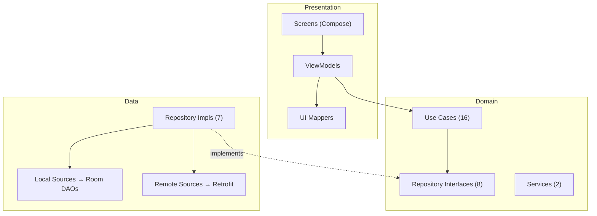
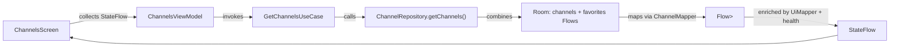
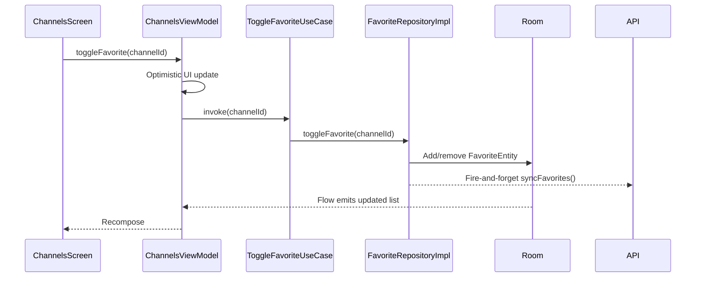
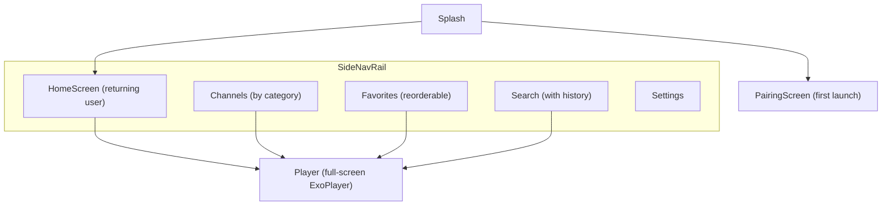

# Architecture

Clean Architecture with three layers. Dependencies flow inward only.



## Presentation Layer

| Component | Role |
|-----------|------|
| `ComposeMainActivity` | Entry point. Uses **Box overlay pattern**: app shell composes behind opaque splash so ViewModels init during splash, not after. Orientation-adaptive: landscape uses side rail, portrait uses bottom nav. |
| `FireVisionNavGraph` | 9 destinations (Jetpack Navigation Compose). Player takes `channelId` argument. |
| ViewModels (6) | `ChannelsViewModel`, `FavoritesViewModel`, `SearchViewModel`, `PlayerViewModel`, `SettingsViewModel`, `PairingViewModel` — all `@HiltViewModel`. |
| UI Mappers | `ChannelUiMapper`, `CategoryUiMapper` — enrich domain models with health status and thumbnails. |

## Domain Layer

Pure Kotlin, no Android dependencies.

| Component | Role |
|-----------|------|
| Domain Models (6) | `Channel`, `Category`, `ChannelHealthStatus`, `PlaybackState`, `SearchFilter`, `EpgProgram` |
| Repository Interfaces (8) | `ChannelRepository`, `CategoryRepository`, `FavoriteRepository`, `PlaybackRepository`, `PlaylistRepository`, `SearchHistoryRepository`, `UserPreferencesRepository`, `EpgRepository` |
| Use Cases (16) | `UseCase<P, R>` (suspend, one-shot) and `FlowUseCase<P, R>` (reactive). Includes: `PullFavoritesUseCase`, `ReportStreamStatusUseCase`, `ReportStreamPlayUseCase`, `SyncHealthResultsUseCase`. |
| Services (2) | `ChannelHealthScanner` (batch HTTP checks + server sync), `ChannelThumbnailExtractor` (frame extraction) |

## Data Layer

| Component | Role |
|-----------|------|
| Room Database | `FireVisionDatabase` (v3): 6 entities — `ChannelEntity`, `CategoryEntity`, `FavoriteEntity`, `SearchHistoryEntity`, `PlaybackPositionEntity`, `ChannelHealthEntity` |
| DAOs (6) | Type-safe SQL queries with `Flow` return types |
| Repository Impls (7) | Offline-first: Room is source of truth, remote refreshes cache. `EpgRepositoryImpl` uses in-memory cache with lazy network load. |
| `FireVisionApiService` | Retrofit: channels, categories, favorites, report-status, report-play, health-sync, app version, device pairing |
| Mappers | `ChannelMapper`, `CategoryMapper` — bidirectional DTO ↔ Entity ↔ Domain |

## Dependency Injection

Hilt with 5 modules in `SingletonComponent`:

| Module | Provides |
|--------|----------|
| `AppModule` | Context, `@IoDispatcher`, `@MainDispatcher` |
| `NetworkModule` | OkHttpClient, Retrofit, `FireVisionApiService` |
| `DatabaseModule` | `FireVisionDatabase`, all 6 DAOs |
| `RepositoryModule` | Binds 6 repo interfaces to impls |
| `ImageLoadingModule` | Coil ImageLoader (25% mem cache, 50MB disk, 300ms crossfade) |

## Data Flows

### Read: Channels Screen



### Write: Toggle Favorite



### Background: Channel Sync

```text
WorkManager (6h) → ChannelSyncWorker → ChannelRepository.refreshChannels()
  → Retrofit GET /channels → Map DTOs → Room @Transaction: delete all + insert
  → Room Flow emits → active ViewModels recompose
```

## Navigation



Sidebar routes use `popUpTo(Home)`, `saveState`, `launchSingleTop`, `restoreState`.

## Key Design Decisions

| Decision | Rationale |
|----------|-----------|
| **Offline-first (Room as source of truth)** | Fire TV may have intermittent connectivity. App always usable with cached data. |
| **Box overlay pattern for pre-warming** | ViewModel `init{}` fires at T=0, Room returns channels by ~T=50ms. When splash fades at ~T=1900ms, HomeScreen already populated. Previous `Crossfade` approach delayed ViewModel creation. |
| **Non-blocking EPG enrichment** | `getNowNextIfCached()` is synchronous, returns `null` if not loaded. Channels render immediately; "Now Playing" appears asynchronously. |
| **Health flow seeding** | `channelHealthDao.getAllHealth().debounce(500ms).onStart { emit(emptyList()) }` — `onStart` AFTER `debounce` seeds combine, so channels render instantly. Real health data updates ~500ms later. |
| **Fire-and-forget health reporting** | `SupervisorJob` — failures silently swallowed, never blocks playback. |
| **Unresponsive stream detection** | `bufferWatchJob` fires after 30s continuous buffering → `onStreamUnresponsive`, reported separately from dead streams. |
| **In-memory alternate stream slots** | Alternates stored in `StreamSlot` queue (not Room) to avoid migrations. Empty on cold start, degrades to primary-only. |
| **Lifecycle-aware resume refresh** | `ON_RESUME` triggers `refresh()` (first resume skipped). Detects server-side changes. |
| **Optimistic UI for favorites** | UI updates immediately, persists in background. Rolls back on error. |
| **Compose for TV over Leanback** | Modern declarative UI with better state management. |
