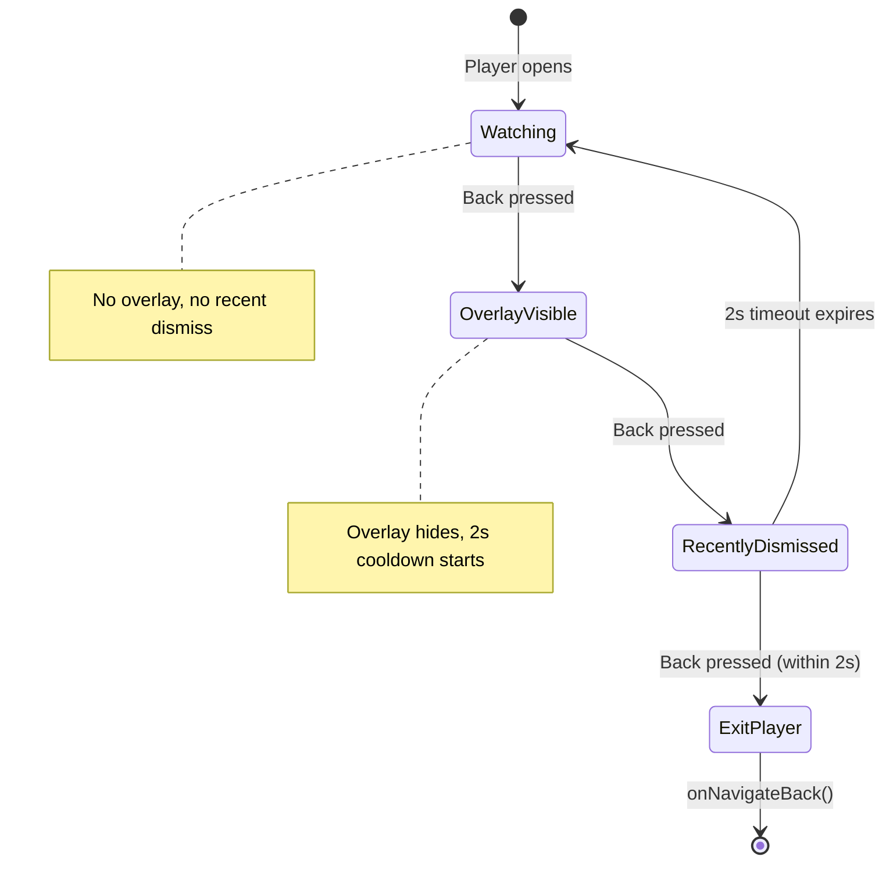
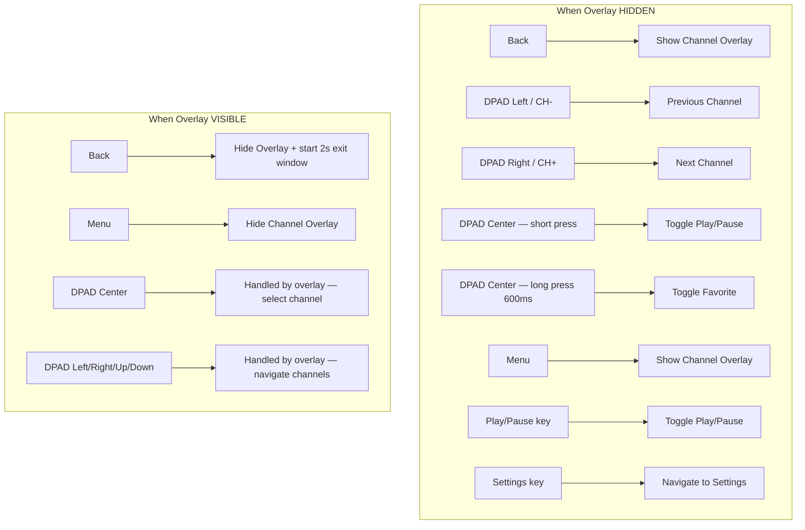

# Player Back Press & Navigation Flow

## Overview

The player screen uses a **3-state back-press state machine** to balance between quick exit and accidental back presses on TV remotes. The channel overlay (Switch Channel sheet) acts as an intermediate step.

---

## Back Press State Machine



## Back Press Logic (PlayerScreen.kt)

```kotlin
BackHandler {
    when {
        uiState.showChannelOverlay -> {   // State: Overlay visible
            viewModel.hideOverlay()        //   → dismiss overlay
            recentlyDismissedOverlay = true //   → start 2s window
        }
        recentlyDismissedOverlay -> {     // State: Just dismissed (within 2s)
            onNavigateBack()               //   → exit player
        }
        else -> {                         // State: Watching (clean)
            viewModel.showOverlay()        //   → show channel overlay
        }
    }
}
```

| State | Back Press Result | Next State |
|-------|-------------------|------------|
| **Watching** (no overlay, no recent dismiss) | Show channel overlay | OverlayVisible |
| **OverlayVisible** (overlay showing) | Hide overlay, start 2s timer | RecentlyDismissed |
| **RecentlyDismissed** (within 2s of hiding) | Exit player → navigate back | Exit |
| **RecentlyDismissed** (2s expired) | → resets to Watching | Watching |

## Quick Exit Path

Back → Back → Back (3 presses) exits the player:
1. First back: shows overlay
2. Second back: hides overlay (starts 2s window)
3. Third back (within 2s): exits player

## Double-back Exit Path

If overlay is already showing (opened via Menu key or DPAD_UP):
1. First back: hides overlay (starts 2s window)
2. Second back (within 2s): exits player

---

## Remote Key Mappings (Full Player Controls)



## Channel Overlay (Switch Channel Sheet)

The overlay is a bottom sheet showing:
- **Category filter row** — horizontal scrollable chips (All, Music, Sports, etc.)
- **Channel grid** — horizontal scrollable cards with logo, name, category
- **"NOW" badge** on currently playing channel
- Current channel info bar at top of player (logo, name, category, LIVE badge)

The overlay slides up from the bottom with fade animation.

**Auto-category selection:** When the overlay opens, the category chip matching the currently playing channel is auto-selected and activated. This filters the channel list to show similar channels from the same category group, making channel switching contextual. The user can still tap "All" or another category to browse other groups.

---

## Auto-Navigation (Dead Stream)

Separate from back-press — when a stream is confirmed dead after all recovery attempts:

```
Stream fails → ErrorRecoveryManager retries (proxy + alternates)
            → All attempts exhausted → onStreamDead
            → 10s countdown with DeadStreamOverlay
            → Auto-navigate back (or user dismisses countdown)
```

## Background Playback (TV vs Phone)

- **Android TV / Fire TV:** Player pauses on `ON_STOP` (Home pressed), resumes on `ON_START`
- **Android Phone:** Player continues in background (no lifecycle pause)
- Detection via `PackageManager.FEATURE_LEANBACK`
