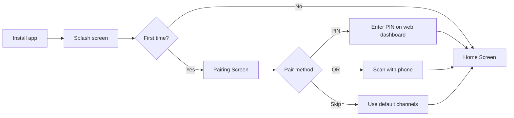
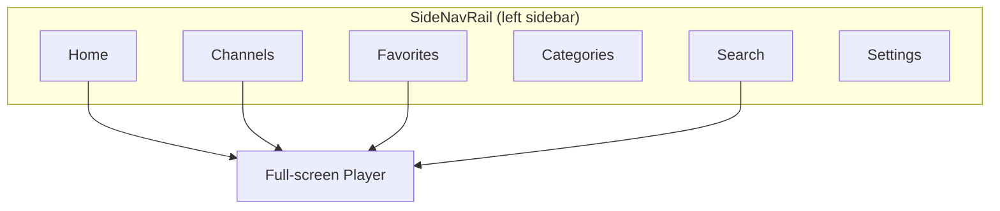

# User Guide

FireVision IPTV streaming app for Fire TV, Android TV, and Android devices (9+).

## First Launch

## Device Pairing

Links your TV to your server account. Two methods:

### PIN Code

1. App displays a 6-digit PIN on TV screen
2. Open server dashboard in browser → device pairing page
3. Enter the PIN and confirm
4. TV detects pairing automatically, loads your channels

### QR Code

1. Scan the QR code shown on TV with your phone
2. Opens pairing page with PIN pre-filled
3. Sign in and confirm

**Notes:** PIN expires after 10 minutes. Both devices must reach the server. "Skip" option available for browsing default channels.

## App Navigation

| Screen | Content |
|--------|---------|
| Home | Featured carousel, recently watched, category rows (10 channels each + "See All") |
| Channels | All channels in grid. Filter by category chips. Health indicators + EPG "Now Playing". |
| Categories | Category cards with channel counts. Select to browse. |
| Favorites | Saved channels. Synced across devices via server. |
| Search | Type-ahead search. History chips for past searches. |
| Settings | Server URL, pairing, health scan, about/updates. |

Sidebar collapses to icons when focus moves to content.

## Favorites

- **Add:** Press Menu on any channel card, or select heart icon in player (long-press center button 600ms)
- **Remove:** Same toggle
- **Sync:** If paired, favorites sync with server across devices

## Player

### Remote Controls

| Button | Action |
|--------|--------|
| Play/Pause | Toggle playback |
| Center (D-pad) | Toggle playback, briefly shows favorite button |
| Menu | Show/hide channel overlay |
| Left / Channel Down | Previous channel |
| Right / Channel Up | Next channel |
| Back | Close overlay → exit player |

### Channel Overlay

Press Menu to show: now playing info, EPG current/next, category chips, channel grid for switching.

### Error Recovery

1. Auto-reconnect with retry count display
2. Falls back to alternate streams if available
3. After all retries fail: "Stream Offline" with 5s auto-navigate countdown (press any button to stay)

### Resume

Playback position saved periodically. Resumes where you left off.

## Settings

### When Not Paired

| Setting | Description |
|---------|-------------|
| Server URL | Your server address (default: `https://tv.cadnative.com`) |
| TV Pairing Code | Manual code entry |
| Pair with PIN | Start PIN pairing flow |

### When Paired

| Setting | Description |
|---------|-------------|
| Paired status | Green indicator + your TV code |
| Reset Pairing | Unpair device (will need to re-pair) |

### Stream Health

| Setting | Description |
|---------|-------------|
| Check Liveliness | Scan all channels. Green = online, red = offline. |

### About

| Setting | Description |
|---------|-------------|
| App Version | Current version |
| Check for Updates | Download + install if available. Mandatory updates flagged. |

## Troubleshooting

| Problem | Fix |
|---------|-----|
| "No channels found" after pairing | Verify server has channels configured in dashboard. Check server URL in Settings. |
| Connection error | Check network, verify server URL, ensure same network for local servers |
| Stream buffering | Run "Check Liveliness" — red channels are offline. Need 5+ Mbps. App auto-tries alternates. |
| PIN expired | Generate new PIN, complete pairing within 10 minutes |
| Pairing stuck "waiting" | Confirm pairing on server dashboard, verify both devices reach server |
| Remote buttons not working | All actions use D-pad, center, back, menu buttons. Menu may be labeled differently on some remotes. |
