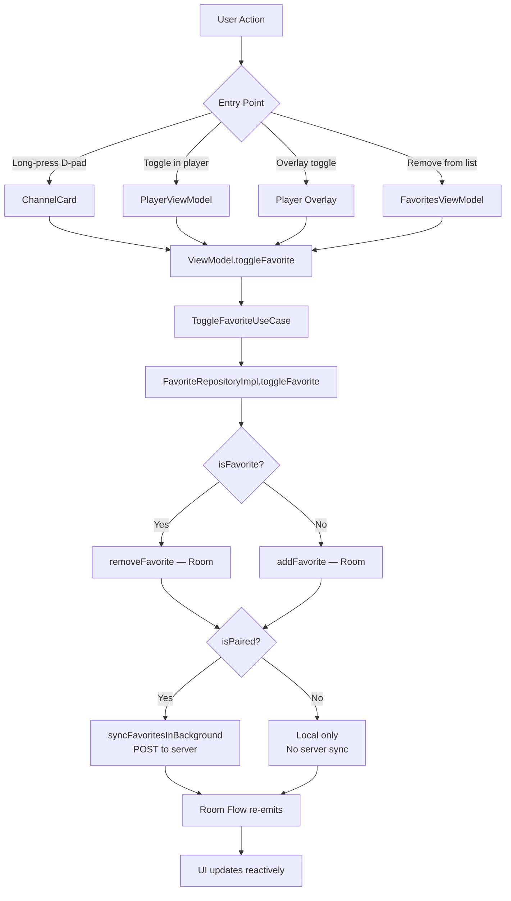
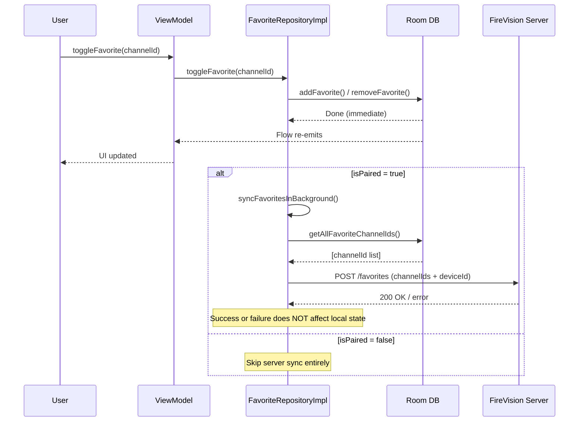

# Favorites Workflow

## Data Model

```
favorites (Room table — NO foreign key to channels)
├── id: Long (auto-generated PK)
├── channelId: String (unique index)
├── addedAt: Long (timestamp)
└── displayOrder: Int (for reordering)
```

Favorites are **independent of the channels table**. No FK CASCADE — channel syncs never delete favorites. The JOIN query in `FavoriteDao.getFavoriteChannels()` naturally excludes favorites whose channel no longer exists.

## Data Flow



## Paired vs Unpaired Users

| Behavior | Paired | Unpaired (default playlist) |
|----------|--------|----------------------------|
| Local favorites | Yes | Yes |
| Server sync on add/remove | Yes | **No** |
| Pull from server | Yes | **No** |
| Persistence | Room DB | Room DB |

Detection: `AppPreferences.getTvCode() != DEFAULT_TV_CODE`

## Entry Points (Add/Remove Favorite)

1. **ChannelCard** (All Channels, Search, Home rows)
   - D-pad long-press (600ms) toggles favorite
   - Menu/Bookmark key instant toggle
   - Uses `onPreviewKeyEvent` to intercept before Card consumes events

2. **Player** (current channel)
   - `PlayerViewModel.toggleFavorite()` — optimistic UI update, revert on error

3. **Player Overlay** (channel list in overlay)
   - `PlayerViewModel.toggleOverlayFavorite(channelId)` — optimistic per-channel

4. **Favorites Screen**
   - `FavoritesViewModel.removeFavorite(channelId)` — optimistic remove from list

## Favorites Screen

- Grid of `ChannelCard` components showing only favorited channels
- Room Flow is reactive — updates when favorites change from any source
- Combined with `channelHealthDao.getAllHealth()` for health status dots
- Supports reordering via `moveFavoriteUp/Down` (updates `displayOrder`)

## Protection Against Data Loss

| Threat | Protection |
|--------|-----------|
| Channel refresh (sync) | `@Upsert` instead of `@Insert(REPLACE)` — no DELETE+INSERT |
| Channel deleted from server | No FK CASCADE — favorite row persists, JOIN excludes it |
| Health scan cleanup | `cleanupOrphaned()` runs after scan, not before |
| Server sync failure | Local DB is source of truth; sync is fire-and-forget |
| App crash during sync | Local write happens first, sync is separate coroutine |

## Server Sync Flow (Paired Users Only)



## Room Queries

- `getFavoriteChannels()`: `INNER JOIN channels ON id = channelId WHERE isActive = 1 ORDER BY displayOrder, addedAt DESC`
- `isFavorite(channelId)`: `EXISTS(SELECT 1 FROM favorites WHERE channelId = ?)`
- `addFavorite()`: `INSERT OR REPLACE`
- `removeFavorite()`: `DELETE WHERE channelId = ?`
