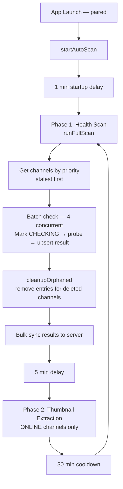
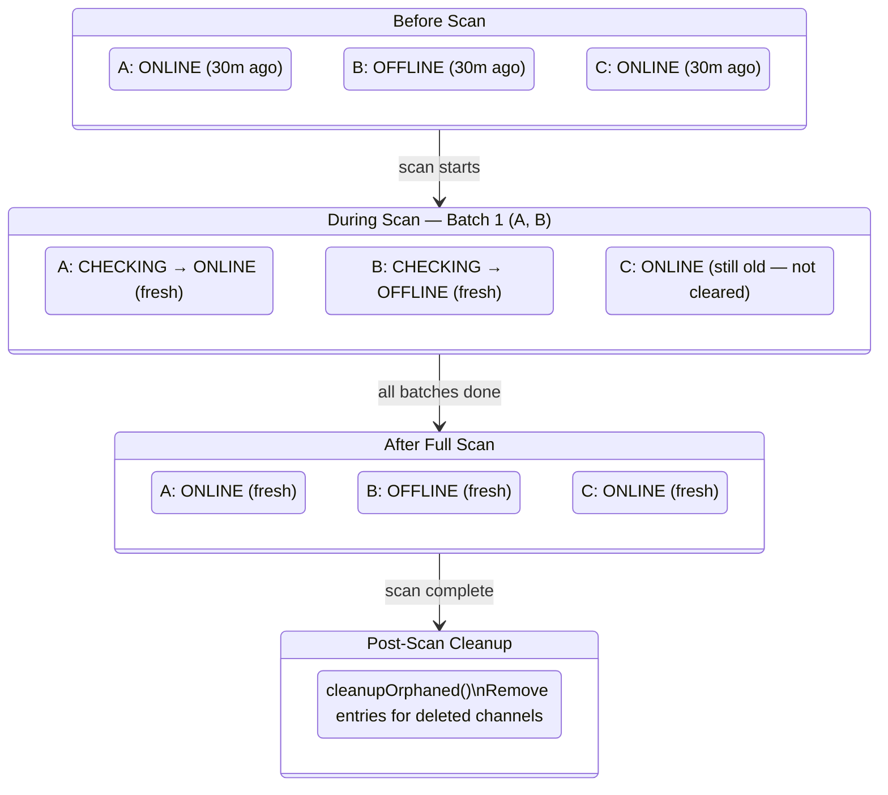
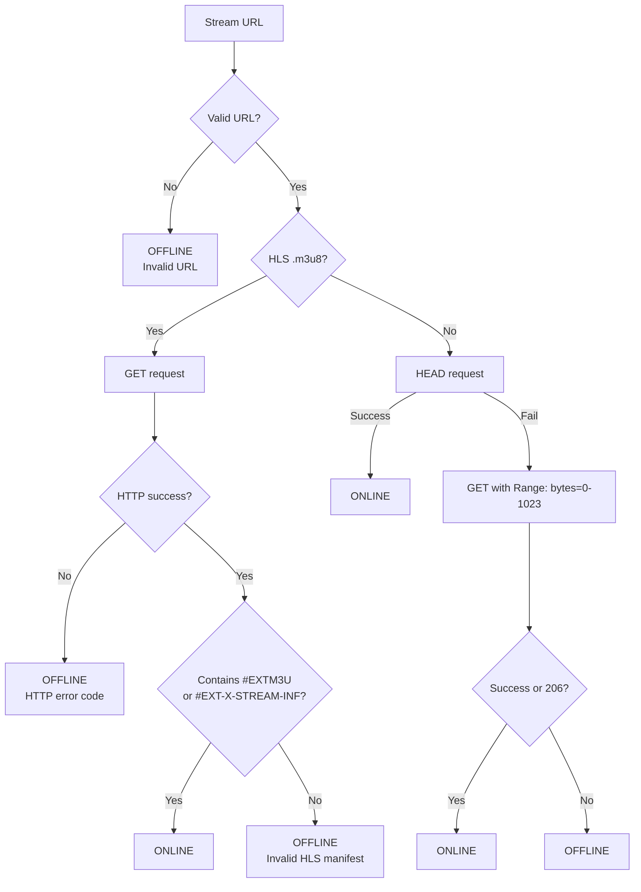

# Health Scanner Lifecycle

## Overview

The `ChannelHealthScanner` checks stream URLs to determine if channels are online/offline. It runs as a singleton background service, started from `ComposeMainActivity` after pairing.

## Lifecycle Phases



## Overlapping Scan Strategy

Old health statuses are **never deleted before a new scan**. The scan updates results incrementally per-batch:



Key: `cleanupOrphaned()` runs AFTER the full scan, not before. Users always see the previous status until a new result replaces it.

## Data Independence

```
channel_health (Room table — NO foreign key to channels)
├── channelId: String (PK)
├── status: ONLINE | OFFLINE | CHECKING | UNRESPONSIVE | UNKNOWN
├── lastCheckedAt: Long
├── responseTimeMs: Long?
├── errorMessage: String?
└── thumbnailPath: String?
```

- No FK CASCADE — channel sync never deletes health data
- `@Upsert` on channels prevents DELETE+INSERT cascade
- `upsertPreservingThumbnail()` updates health without losing thumbnail path

## Scan Priority

Channels are scanned in order of `lastCheckedAt ASC` — stalest first:

```sql
SELECT c.id FROM channels c
LEFT JOIN channel_health h ON c.id = h.channelId
WHERE c.isActive = 1
ORDER BY COALESCE(h.lastCheckedAt, 0) ASC
```

New channels (no health entry) get priority (`COALESCE` returns 0).

## Batch Processing

- Batch size: 4 channels concurrent
- Per batch:
  1. Mark all as CHECKING (preserves thumbnail)
  2. Fetch stream URLs from channels table
  3. `async` check each stream (HLS validation or HEAD/GET)
  4. Upsert results (preserves thumbnail)

## Stream Check Logic



Timeouts: 6s connect, 6s read.

## Manual Scan

`triggerManualScan()` cancels any running scan and starts fresh:
1. Runs `runFullScan()` immediately
2. Then resumes the auto cycle (thumbnail extraction → cooldown → repeat)

## Integration Points

- `PlayerViewModel.onStreamDead()` → writes OFFLINE directly via `channelHealthDao.upsertPreservingThumbnail()`
- `PlayerViewModel.onStreamUnresponsive()` → writes UNRESPONSIVE
- `SettingsScreen` → triggers `triggerManualScan()`, shows `scanProgress`
- `ChannelCard` → reads health via `ChannelUiModel.healthStatus` (HealthIndicatorDot)
- Server sync: bulk POST health results after scan completes
